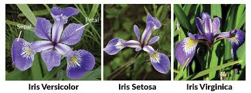

# 🌸 Iris Flower Species Predictor – Powered by Machine Learning 🌿

Welcome to the **Iris Flower Predictor App**!  
This web app uses a Logistic Regression model to predict the species of an Iris flower based on user-provided measurements.



---

## 🚀 Built With

- **Python**
- **Scikit-learn**
- **Streamlit**
- **Numpy**
- **Pickle**

---

## 📊 Dataset

The app is trained using the classic **Iris Dataset**, which contains 150 rows and 4 features:

- Sepal Length
- Sepal Width
- Petal Length
- Petal Width

Target species:

- *Iris-setosa* 🌸  
- *Iris-versicolor* 🌿  
- *Iris-virginica* 🌺  

---

## 🧠 How It Works

1. A Logistic Regression model is trained using the Iris dataset.
2. The model is serialized and saved as a `.pkl` file using `pickle`.
3. A user-friendly web app is created using Streamlit.
4. Users interact with sliders to provide flower measurements.
5. The model predicts and displays the Iris species.

---

## 📁 Files Included

| File                | Description                                    |
|---------------------|------------------------------------------------|
| `app.py`            | Streamlit web app source code                  |
| `logistic_model.pkl`| Trained ML model using Logistic Regression     |
| `iris_flower.jpg`   | Flower image used in the UI                    |
| `README.md`         | Project documentation                          |

---

## 💻 How to Run Locally

1. **Clone the repository**:
   ```bash
   git clone https://github.com/your-username/iris-flower-predictor.git
   cd iris-flower-predictor

   

🚀 Installation and Running the App

# Clone the repo
git clone https://github.com/your-username/iris-flower-classifier.git
cd iris-flower-classifier

# Install required packages
pip install -r requirements.txt

# Run the Streamlit app
streamlit run app.py

